# Series Hybrid Powertrain – MATLAB/Simulink

Model-based design and simulation of a series hybrid electric powertrain using MATLAB/Simulink.

The project covered vehicle-level power and energy modelling, component sizing, electric motor and engine-generator selection, battery modelling, vehicle dynamics, full-load performance verification and development of engine-generator control logic.

The design was evaluated using the WLTP Class 3 driving cycle and vehicle performance targets including acceleration, maximum speed and electric driving range.

## Key Engineering Outcomes

- Developed a forward vehicle power model using the WLTP Class 3 drive cycle
- Calculated tractive, regenerative and net energy requirements
- Sized and selected the traction motor, internal combustion engine, generator and battery pack
- Developed Simulink models for the ICE, generator, electric motor, battery and vehicle dynamics
- Implemented efficiency-map and lookup-table based component modelling
- Modelled battery State of Charge using an equivalent R-int battery model
- Verified maximum speed and 0–100 km/h acceleration under full-load conditions
- Investigated regenerative braking energy recovery
- Developed PI-based engine-generator control logic
- Identified controller-stability and battery peak-current limitations requiring further design iteration

## Powertrain Architecture

The vehicle uses a **series hybrid architecture**.

In this configuration, the internal combustion engine does not mechanically drive the wheels. Instead, the engine drives a generator that produces electrical power.

Electrical energy can then:

- Supply the traction motor
- Charge the battery
- Support vehicle propulsion together with stored battery energy

The traction motor is the only component mechanically connected to the driven wheels.

## Top-Level Simulink Model

The system-level Simulink model integrates:

- WLTP drive-cycle input
- Driver demand
- Battery model
- Electric motor drive
- Internal combustion engine
- Generator
- Engine-generator shaft dynamics
- Gearbox and tyre model
- Vehicle dynamics
- Feedback control

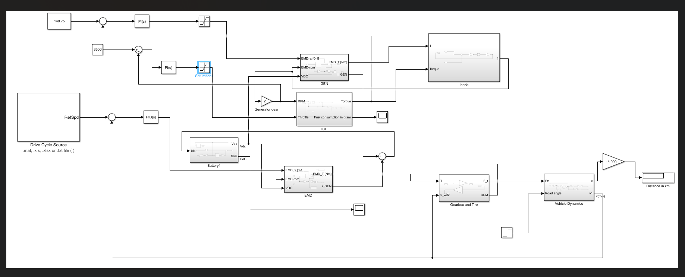

## Vehicle Design Targets

The vehicle model was based on a compact passenger-car configuration.

Key design targets included:

- Base vehicle mass: **1250 kg**
- Frontal area: **2.00 m²**
- Drag coefficient: **0.284**
- Rolling-resistance coefficient: **0.019**
- Tyres: **185/65 R15**
- Target 0–100 km/h acceleration: **6.1 s**
- Target maximum speed: **187 km/h**
- Target electric range: **32 km**

An estimated additional powertrain mass was incorporated into the vehicle model for component sizing and simulation.

## WLTP Forward Power Analysis

A forward power model was developed to estimate the instantaneous traction demand over the WLTP Class 3 driving cycle.

The power profile includes positive propulsion demand and negative power during deceleration and regenerative-braking events.

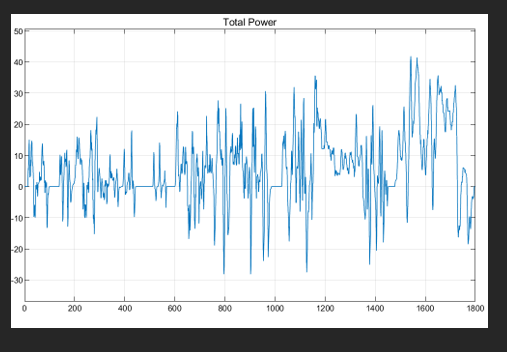

### Energy Analysis

The calculated WLTP energy values were:

| Parameter | Result |
|---|---:|
| Tractive energy | **3.503 kWh** |
| Regenerative energy | **0.7473 kWh** |
| Net energy demand | **2.756 kWh** |
| Approximate recovered energy | **21.3% of tractive energy** |

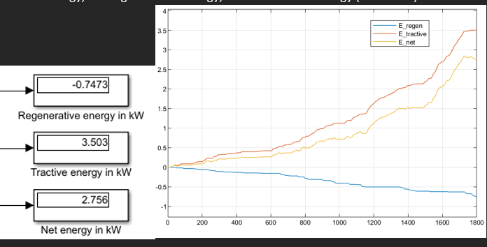

The average and peak traction-power demands were:

- Average tractive power: **7.006 kW**
- Maximum tractive power: **41.87 kW**

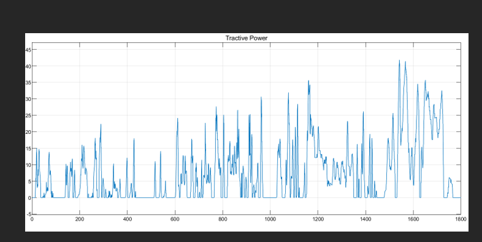

## Traction Motor Selection

A single-motor configuration was selected.

The chosen electric machine was the **CUM_140 surface-mounted permanent-magnet synchronous motor (SPMSM)**.

Key specifications used in the project were:

| Parameter | Value |
|---|---:|
| Rated power | **140 kW** |
| Rated torque | **340 Nm** |
| Maximum speed | **14,000 rpm** |
| Base speed | **3932 rpm** |
| Required DC voltage | **428 V** |
| Maximum current | **560 A** |
| Gear ratio | **8:1** |

The motor was selected to satisfy the acceleration and maximum-speed targets while maintaining a single-motor drivetrain architecture.

## Engine Selection

The selected internal combustion engine was the **CU-ICE_90**.

The engine model used throttle and engine speed as inputs to lookup tables representing torque generation and brake-specific fuel consumption.

The engine-selection analysis identified a low-BSFC operating region around:

- Engine speed: **2000 rpm**
- Throttle: **80%**
- Torque: approximately **151.5 Nm**
- BSFC: approximately **215.6 g/kWh**

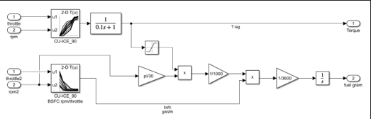

## Generator Selection

A **CUM_140** electric machine was also selected for generator modelling.

The generator was sized to provide sufficient power capacity relative to the selected ICE and was modelled using speed-dependent torque characteristics and an efficiency map.

A nominal engine-generator gear ratio of approximately **2:1** was investigated to match the operating characteristics of the two machines.

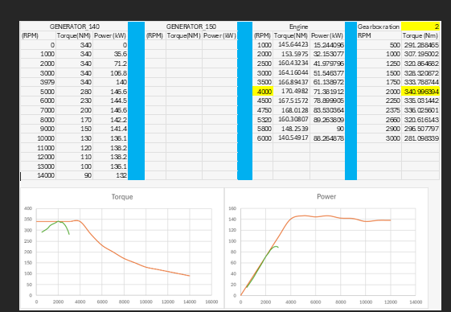

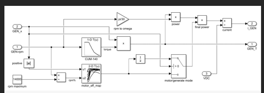

## Electric Motor Model

The traction-motor subsystem was developed using:

- Motor-speed input
- Torque-demand command
- Torque-speed lookup data
- Motor efficiency map
- Mechanical-to-electrical power conversion
- DC-current calculation

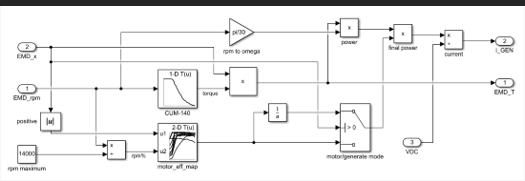

## Battery Design

The battery model was based on the Panasonic NCR18650GA lithium-ion cell.

The energy-based pack design used:

- Cell nominal voltage: **3.6 V**
- Cell capacity: **3.3 Ah**
- Series cells: **119**
- Parallel strings: **4**
- Total cells: **476**
- Nominal pack voltage: approximately **428.4 V**
- Nominal pack capacity: **13.2 Ah**
- Approximate energy capacity: **5.65 kWh**
- Cell-only mass estimate: approximately **22.85 kg**

The pack was designed primarily from the required system voltage and electric-range energy requirement.

### Battery Modelling

A simplified **R-int equivalent-circuit model** was implemented in Simulink.

Open-circuit voltage and internal resistance were represented as functions of State of Charge.

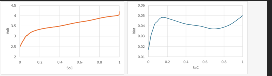

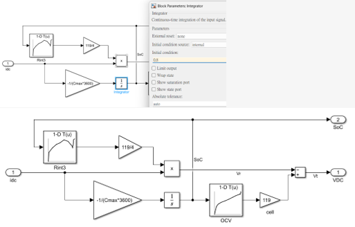

### Battery Design Limitation

The energy-sized 119s4p configuration provides approximately 40 A when using a 10 A per-cell discharge assumption, which is substantially below the listed peak-current capability required by the selected motor.

Therefore, the battery design would require further iteration for peak-power operation, such as increasing the number of parallel cells or revising the power-system architecture.

## Vehicle Dynamics

The vehicle-dynamics subsystem converts motor torque into tractive force and calculates vehicle acceleration from the combined effects of:

- Tractive force
- Aerodynamic drag
- Rolling resistance
- Road-gradient resistance
- Vehicle mass

Transmission efficiency between the motor and wheels was modelled as approximately **90%**.

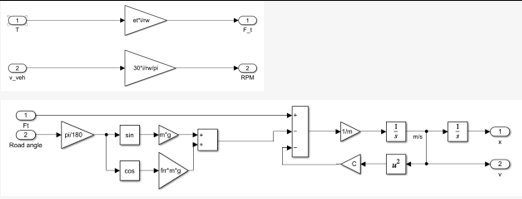

## Full-Load Model Verification

The developed powertrain model was evaluated under a full-load electric-drive condition with the engine-generator disabled.

### Maximum Speed

The simulation produced an attainable maximum speed of approximately:

**59.06 m/s**

compared with the required:

**51.94 m/s**

This corresponds to approximately **212.6 km/h** versus a design target of approximately **187 km/h**.

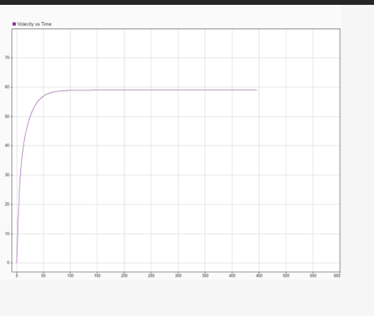

### Acceleration

The simulated 0–100 km/h acceleration time was:

**6.082 s**

compared with the required:

**6.1 s**

The simulation therefore closely matched the specified acceleration target.

### Battery State of Charge

Battery State of Charge was evaluated during the full-load simulation from an initial value of approximately 90%.

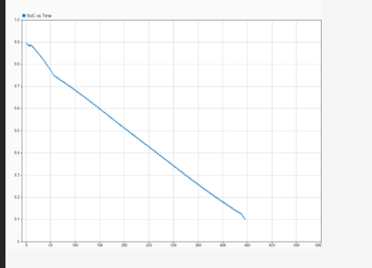

### Full-Load Electric Range

For the simulated discharge window from approximately 90% to 10% SoC:

- Simulated range: **25.57 km**
- Target electric range: **32 km**

The full-load range therefore did not achieve the target under this test condition, identifying battery capacity and power demand as areas requiring further optimisation.

## Engine-Generator Controller Development

A low-level engine-generator control architecture was developed using two PI controllers.

The intended controller functions were:

- Control engine speed through throttle manipulation
- Control generator loading to regulate engine torque

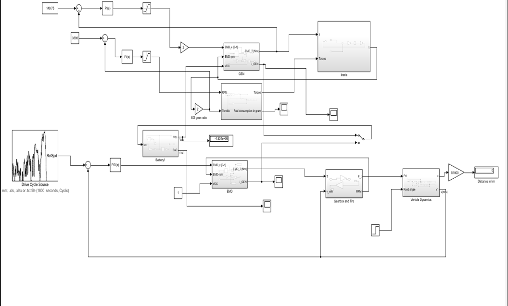

Controller development revealed stability and tuning challenges. The model did not consistently maintain the desired engine operating point, indicating that further PI tuning and refinement of the engine-generator dynamic model would be required.

This limitation was retained as an engineering outcome rather than treating the controller as fully validated.

## Engineering Challenges and Lessons

The project highlighted several important model-based powertrain design considerations:

- Component sizing must consider both energy and peak-power requirements
- Battery energy sizing alone does not guarantee sufficient peak current
- Motor sizing must simultaneously satisfy acceleration and maximum-speed constraints
- Engine-generator matching requires consideration of torque, power and speed ranges
- Regenerative braking can significantly reduce net drive-cycle energy consumption
- Controller performance depends strongly on subsystem dynamics and PI tuning
- Vehicle mass assumptions directly influence energy consumption and performance predictions

## Further Development

Future improvements could include:

- Redesigning the battery pack for both energy and peak-current requirements
- Refining motor and generator efficiency-map scaling
- Re-tuning the engine-generator PI controllers
- Developing a complete supervisory Vehicle Control Unit
- Implementing SoC-based engine on/off logic
- Comparing simulated WLTP speed tracking with the reference cycle
- Calculating fuel consumption and CO₂ emissions
- Conducting sensitivity analysis on mass, drag and gear ratio
- Validating component models against experimental or manufacturer data

## Tools and Methods

- MATLAB
- Simulink
- Model-Based Design
- WLTP Class 3
- Series Hybrid Electric Vehicle
- Vehicle Dynamics
- Permanent Magnet Synchronous Motor
- Engine BSFC Mapping
- Electric-Machine Efficiency Maps
- Battery R-int Modelling
- State of Charge Modelling
- Regenerative Braking
- PI Control
- Powertrain Component Sizing

## Project Type

MSc Automotive Engineering group project in Advanced Propulsion Systems.

The repository presents selected technical outputs from the project and does not include restricted coursework instructions or university-provided assessment materials.
